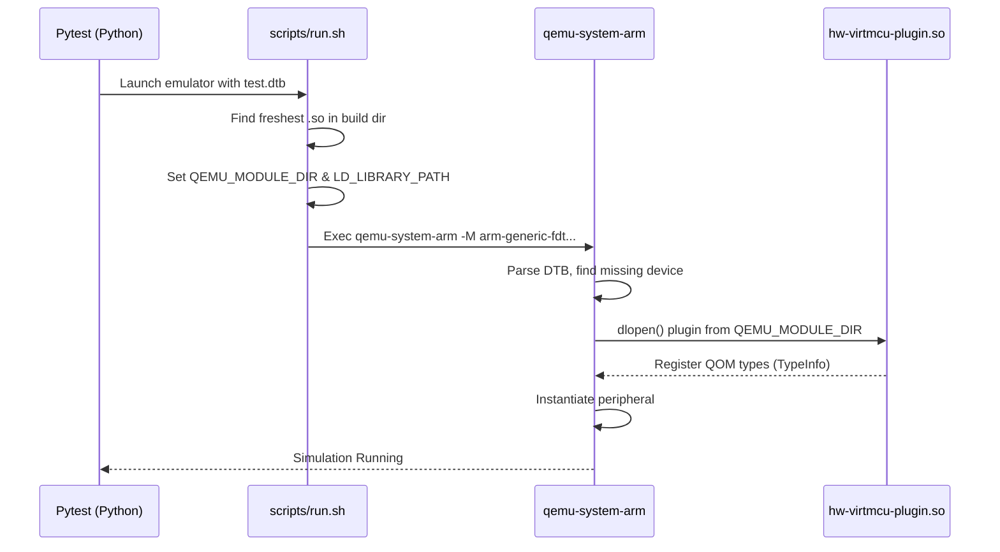
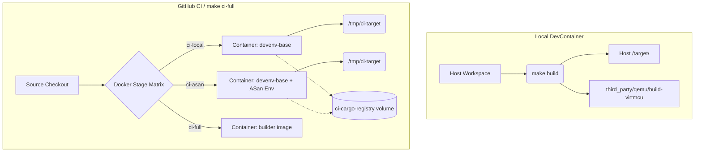

# VirtMCU Build & Execution Architecture

VirtMCU is a bifurcated system combining a heavy C-based emulator (QEMU) with modular, dynamic peripherals (QOM plugins) written primarily in Rust. To maintain rapid development cycles and memory safety, the build system employs symlinking, dynamic library loading (`dlopen`), and strict cache isolation between local and CI environments.

## 1. What Gets Built, When, and Where

The codebase is divided into three primary build domains: **Dependencies**, **QEMU Core + Plugins**, and **Host Orchestration Tools**.

### A. Dependencies (C/C++)
* **What:** `zenoh-c` (for native plugin communication) and `flatcc` (for telemetry serialization).
* **When:** Built once during `make setup-initial` or pre-compiled into the Docker base image.
* **Where:** Downloaded to `third_party/zenoh-c` and `third_party/flatcc`.

### B. QEMU Core & Rust Plugins
* **What:** The patched `qemu-system-arm/riscv` binaries and the dynamic peripheral models (`hw-virtmcu-*.so`).
* **When:**
  * **Core:** Built initially via `make setup-initial`. Rarely rebuilt unless QEMU C code/patches change.
  * **Plugins:** Rebuilt frequently via `make build` when `hw/rust/` code changes.
* **Where:** 
  * QEMU is cloned to `third_party/qemu`.
  * The project’s `hw/` and `Cargo.toml` are **symlinked** into QEMU’s tree (`third_party/qemu/hw/virtmcu`).
  * Outputs land in either `third_party/qemu/build-virtmcu` or `third_party/qemu/build-virtmcu-asan` (if `VIRTMCU_USE_ASAN=1` is set).

### C. Host Orchestration Tools (Rust/Python)
* **What:** Python test suites (`pytest`), Rust coordinators (`zenoh_coordinator`), and bridges (`mujoco_bridge`).
* **When:** Built on-demand when running `make test-integration` or directly via `cargo build`.
* **Where:** Rust artifacts land in the workspace `target/` directory.

---

## 2. The Dual-Output Strategy (Standard vs. ASan)

To prevent cache thrashing when switching between standard development and Memory Sanitizer (ASan) debugging, QEMU and its plugins compile into entirely isolated directories based on the `VIRTMCU_USE_ASAN` environment variable.

```mermaid
graph TD
    A[Source Code: hw/rust/*] --> B{VIRTMCU_USE_ASAN ?}
    
    B -->|0 (Standard)| C[third_party/qemu/build-virtmcu]
    B -->|1 (ASan Enabled)| D[third_party/qemu/build-virtmcu-asan]
    
    C --> C1[qemu-system-arm]
    C --> C2[hw-virtmcu-*.so]
    
    D --> D1[qemu-system-arm (Instrumented)]
    D --> D2[hw-virtmcu-*.so (Instrumented)]
```

* **Standard Build:** Optimizes for speed. 
* **ASan Build:** Compiles QEMU with `--enable-asan --enable-ubsan` and Rust plugins with `-fsanitize=address`. Output is isolated to avoid overwriting standard binaries.

---

## 3. Linking & Execution: Who Drives Who?

Because VirtMCU relies on QEMU's dynamic module system, **Rust plugins do not link against QEMU at compile time; QEMU links against them at runtime.**

1. **Discovery (`run.sh`):** When a test calls `subprocess.Popen(["scripts/run.sh", ...])`, the script determines where to find the plugins based on a prioritized fallback system:
    *   **Developer Mode (Default):** It recursively searches the active local build directory (`third_party/qemu/build-virtmcu[-asan]`) to find the most recently modified `.so` plugins, ensuring you are testing your latest code.
    *   **Installed Mode (`VIRTMCU_SKIP_BUILD_DIR=1`):** If this environment variable is set (or if the local build directory is missing, as is the case in CI `qemu-base` Docker images), `run.sh` bypasses the local build tree completely.
    *   **Fallback Paths:** It then searches standard installation paths in priority order:
        1. `/opt/virtmcu/lib/aarch64-linux-gnu/qemu` (ARM64 Ubuntu/Debian)
        2. `/opt/virtmcu/lib/x86_64-linux-gnu/qemu` (AMD64 Ubuntu/Debian)
        3. `/opt/virtmcu/lib/qemu` (Generic fallback used by our Dockerfiles)
2. **Environment Injection:** Once found, `run.sh` sets `QEMU_MODULE_DIR` to the exact directory containing the plugins, and appends `zenoh-c` library paths to `LD_LIBRARY_PATH`.
3. **Execution (`dlopen`):** `qemu-system-arm` starts. When the Device Tree (DTB) requests a device (e.g., `test-rust-device`), QEMU searches `QEMU_MODULE_DIR` and uses `dlopen()` to load `hw-virtmcu-test.so` into its memory space.



---

## 4. Workflows: Local DevContainer vs. GitHub CI

The build system behaves slightly differently depending on the environment to maximize cache hits locally while preventing cache corruption in CI.

### Local Development (DevContainer)
* **QEMU Pre-installed:** The Docker image provides a pre-built QEMU at `/opt/virtmcu`. If you only modify Python or Rust orchestration tools, you *never* compile QEMU.
* **Incremental Plugin Builds:** When you modify `hw/rust`, running `make build` delegates to QEMU's Meson build system, which in turn invokes `cargo`.
* **Stateful Cargo:** Uses the host's `~/.cargo` and the workspace's `target/` directory, meaning incremental compilation is lightning fast.

### GitHub CI / Automated Matrix (`make ci-full`)
GitHub CI utilizes a deeply nested Docker isolation strategy to guarantee reproducibility across `lint`, `asan`, and `miri` passes.

* **Ephemeral Targets (`CARGO_TARGET_DIR`):** Unlike local dev, CI passes `CARGO_TARGET_DIR=/tmp/ci-target` into the Docker containers. This ensures that a `test-asan` container does not pollute the `target/` directory of a `test-miri` container. *Sharing target directories across different compiler flags or CARGO_HOME environments corrupts Rust fingerprint caches.*
* **Registry Volume (`ci-cargo-registry`):** To avoid downloading crates every run, a named Docker volume caches the registry tarballs.
* **Multi-Stage Build:** GitHub builds a `builder` image containing everything, runs the integration tests inside it (`scripts/ci-phase.sh`), and extracts coverage data.

### Environment Matrix Diagram



## Summary of the CI Pipeline
1. **Developer pushes code.**
2. **Fast Gates (Hooks/CI-Local):** `make lint` and `make test-unit` run instantly.
3. **Sanitizer Matrix:** `ci-asan` runs the full QEMU integration suite under Memory Sanitizers.
4. **Miri Matrix:** `ci-miri` runs pure-Rust logic checks for undefined behavior.
5. **Full Integration:** The `builder` Docker image is compiled (which compiles QEMU + plugins *inside* Docker) and runs the entire Phase 1-25 integration suite (`pytest`).
6. **Artifacts:** If successful, coverage is pushed and a release image is tagged.