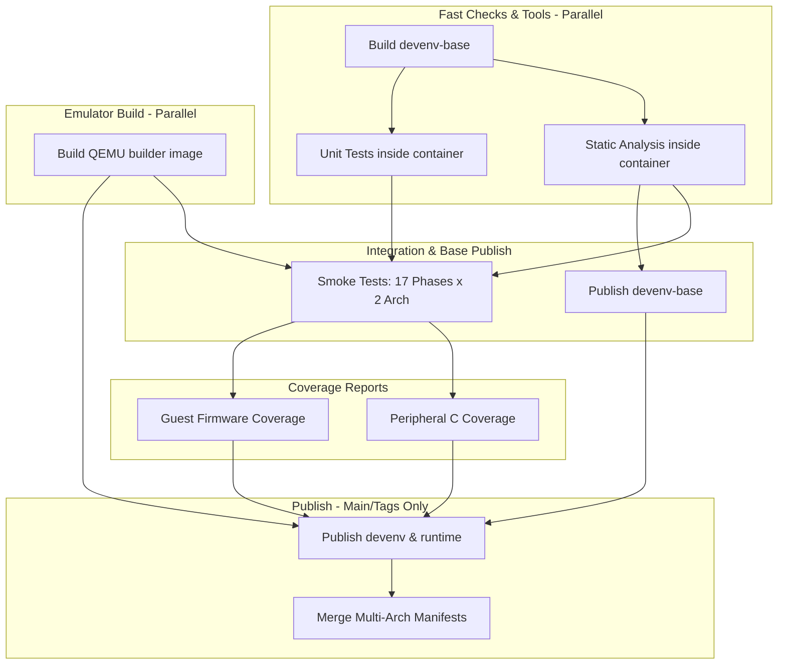

# CI/CD Guide

How to understand the optimized CI pipeline, reproduce failures locally, and know when a failure is your code vs. a flaky runner.

---

### Git Hooks (Pre-Commit / Pre-Push)
To avoid committing or pushing code that will fail Tier 1, you can install automated Git hooks. 

By default, many developers run a `pre-commit` hook that acts as a strict local lint gate. When you run `git commit`, it automatically executes `make lint`. This runs our full suite of fast static analyzers:
- **`ruff`** (Python syntax and styling)
- **`shellcheck`** (Bash script logic)
- **`hadolint`** (Docker best practices)
- **`cargo clippy` & `cargo fmt`** (Rust)
- **`meson fmt`** (Build script syntax)
- **`actionlint`** (GitHub Actions workflows)
- **`yamllint`** (Platform and board YAMLs)
- **`mypy`** (Python static type checking)
- **`clang-format`** (C code formatting)
- **`cppcheck`** (Deep C static analysis)
- **`codespell`** (Universal typo prevention)
- **`cargo audit`** (Rust vulnerability scanning)
- **`virtmcu-tools`** (Python package build verification)

If any of these fail, the commit is blocked. For formatting errors (like trailing spaces in YAML, or C code styling), simply run **`make fmt`** to automatically fix them, then re-add your files and commit.

To install the official hooks (which runs this same `make lint` suite right before `git commit` and `git push`), run:
```bash
make install-hooks
```

## Pipeline Overview (The 5-Tier Optimized Workflow)

Our GitHub Actions pipeline (`ci.yml`) is a highly optimized, fully unified workflow that triggers on PRs, pushes to `main`, and version tags (`v*.*.*`). It is structured into 5 logical tiers that execute sequentially to fail fast, saving compute time and registry bandwidth.



### Tier 1: Fast Static Analysis & Unit Tests (`tier1-checks`)
**Purpose:** Catch syntax, typing, and logic errors instantly before attempting any expensive QEMU compilations.
**Optimization:** 
1. **Toolchain Decoupling:** Heavy C-level simulation dependencies (like `flatcc` and `zenoh-c`) have been moved into a separate `simulation-toolchain` stage. Tier 1 inherits from a *lean* `toolchain` stage, meaning it skips redundant builds and warnings, guaranteeing a fast startup.
2. **Secure 1:1 Parity:** To prevent "Works on My Machine" bugs, this job builds the lightweight `virtmcu-devenv-base` Docker image. It then executes the entire `make lint` and `make test-unit` suites strictly **inside** that isolated container.
3. **Workspace Permissions:** The GitHub Actions runner executes as UID 1001, but the `devenv-base` container strictly drops privileges to the `vscode` user (UID 1000). To avoid `Permission denied` errors (e.g., when creating a `.venv` or `.ruff_cache`), the workflow explicitly runs `sudo chown -R 1000:1000 .` *before* the containers start.

### Tier 2: Build & Cache QEMU (`build-qemu`)
**Purpose:** Compile QEMU and Zenoh FFI bindings. Runs in parallel with Tier 1.
**Optimization:** Runs on both `amd64` and `arm64`. To drastically reduce build times, the Dockerfile uses a **two-stage caching strategy**:
1.  **`qemu-builder` Stage:** Inherits from `simulation-toolchain` (which compiles `flatcc` without warnings). It clones QEMU, applies core patches via the centralized `scripts/apply-qemu-patches.sh`, and configures the build system with a dummy peripheral module. Because it does *not* copy the project's custom `hw/` directory, this stage caches the heavy (~40 minute) QEMU core compilation. **This cache is only invalidated if you change the `VERSIONS` file or modify the core patches.**
2.  **`builder` Stage:** Copies the actual `hw/` directory and compiles the custom peripherals. This takes only ~3 minutes.

Instead of just populating a local GHA layer cache, it builds the final `builder` Docker target and **pushes it directly to GHCR** as an intermediate image (`virtmcu-builder:sha-<hash>-<arch>`). This acts as an ultra-fast binary cache for the rest of the pipeline.

### Tier 3: Integration Smoke Tests (`smoke-tests`)
**Purpose:** End-to-end testing across all architectures.
**Optimization:** A massive matrix fans out across 20 test phases (Phase 1-27, QMP, Robot) × 2 architectures (40 parallel runners). Each runner instantly `docker pull`s the intermediate `builder` image pushed in Tier 2, completely bypassing redundant Docker layer resolution or compilation.

### Tier 4: Deep Coverage Reports
**Purpose:** Collect and unify coverage data.
**Jobs:** `peripheral-coverage` merges `gcovr` data from all 20 smoke test runners. `firmware-coverage` runs guest execution coverage via the QEMU TCG `drcov` plugin.

### Tier 5: Multi-Arch Publishing (Late Publishing)
**Purpose:** Build and push the final user-facing images.
**Optimization:** Only runs on `main` pushes or version tags. Because it relies on the `builder` image already pushed in Tier 2, it leverages `type=registry` caching to compile the final `devenv` and `runtime` images almost instantly. Finally, it stitches them into unified multi-arch tags.

---

## Reproducing the Pipeline Locally (`make ci-full`)

The command `make ci-full` is an extremely faithful reproduction of the CI pipeline logic designed for your local machine.

### How closely does it match CI?

| Feature | GitHub CI | Local `make ci-local` / `make ci-full` |
| :--- | :--- | :--- |
| **Execution Environment** | Isolated `devenv-base` container | Identical isolated `devenv-base` container (1:1 parity) |
| **Scripts Run** | `bash scripts/ci-phase.sh <phase>` | `bash scripts/ci-phase.sh all` |
| **Architectures** | Runs against both `amd64` and `arm64` | Runs against your host architecture only |
| **Concurrency** | 34 parallel runners (Matrix fan-out) | Sequential execution loop |
| **Image Caching** | Pushes/pulls intermediate images to GHCR | Uses local Docker cache only |
| **Stall Timeouts** | `VIRTMCU_STALL_TIMEOUT_MS=60000` | Identical (60000ms) |

**Conclusion:** `make ci-local` and `make ci-full` are perfect for proving functional correctness before pushing. If it passes locally, you are 99% guaranteed to pass CI because both execute inside the exact same lightweight `virtmcu-devenv-base` container image.

### Running Local Validation

```bash
# Pre-push validation (Builds devenv-base and runs Lints & Unit Tests inside it) — ~2-5 min
make ci-local

# Fast isolated testing of Rust Undefined Behavior via Miri
make ci-miri

# Fast local check of Memory Sanitizers (ASan/UBSan)
make ci-asan

# Full pipeline validation (Tier 1-4 parity, builds the heavy QEMU image) — ~40-50 min cold
# This MUST be run to guarantee that all GitHub checks will pass.
make ci-full
```

---

## Tier 1 Failure Guide

### `lint` job

| CI step | Local command | Fix |
|---|---|---|
| Ruff | `uv run ruff check tools/ tests/ patches/` | `make fmt` |
| ShellCheck | `shellcheck scripts/*.sh` | Review code, e.g., quote variables |
| Hadolint | `hadolint docker/Dockerfile` | Add `# hadolint ignore=SCxxxx` if strictly necessary |
| Rust Lint | `cargo clippy` in `hw/rust` | `make lint` or `cargo clippy` |
| Meson Lint | `meson fmt hw/meson.build` | `make fmt` |
| Action Lint | `actionlint` | Review GitHub Actions workflow syntax |
| Yaml Lint | `yamllint` | `make fmt` (or fix YAML trailing spaces/indent) |
| Python Types | `mypy tools/ tests/` | Add missing types or `# type: ignore` |
| Cargo Audit | `cargo audit` in `hw/rust` | Upgrade vulnerable crate or allow |
| C Format | `clang-format` on `hw/` | `make fmt` or `clang-format -i` |
| Cppcheck | `cppcheck` on `hw/` | Fix logic error or add suppression |
| Codespell | `codespell` | `make fmt` (some cases) or fix typo |

### `check-versions` job
If this fails, your `VERSIONS` file is out of sync with downstream dependencies like `Dockerfile`, `pyproject.toml`, or Rust `Cargo.toml`.
**Fix:** Run `make sync-versions && make check-versions`. Never hand-edit downstream files; the sync script owns them.

---

## Running a specific Phase Smoke Test Locally

If CI fails on a specific matrix node (e.g., `Phase 7` on `amd64`), you can run exactly that test inside the pre-built container locally:

```bash
# Ensure your local builder image is up to date:
make docker-builder

# General pattern (replace <pre-command> and test/phaseN):
docker run --rm \
  -v "$(pwd):/workspace" -w /workspace \
  -e PYTHONPATH=/workspace \
  -e VIRTMCU_STALL_TIMEOUT_MS=60000 \
  virtmcu-builder:dev \
  bash -c "<pre-command> && bash test/phaseN/smoke_test.sh"
```

*(Check `.github/workflows/ci.yml` under the `smoke-tests` step for the exact `<pre-command>` required by each phase).*

---

## Flaky vs. Broken

| Pattern | Diagnosis | Action |
|---|---|---|
| Job passes on re-run without code changes | Flaky runner (OOM, network timeout, cache miss) | Re-run the failed job via GitHub UI |
| Job fails on every run, was green before PR | Your change broke something | Run `make ci-full` and identify the failure |
| Builder cache miss causes timeout | Upstream QEMU fetch is slow | Re-run; if persistent, check GitHub Status |
| `check-versions` fails | You bumped `VERSIONS` but forgot to sync | `make sync-versions && git commit -a --amend` |
