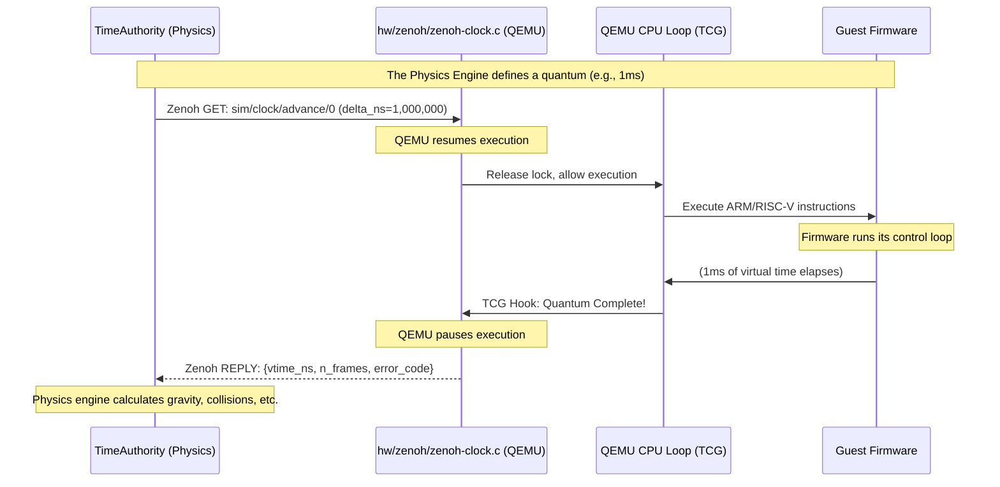

# virtmcu Time Management and Synchronization

This document explains how **virtmcu** handles time. It covers how QEMU is forced to act as a deterministic "time slave" to an external physics engine, the different clock modes available, the internal mechanisms (TCG hooks and the Big QEMU Lock), and the rationale behind these design choices.

---

## 1. The Core Philosophy: Physics is the Master

Standard QEMU is designed to run as fast as possible, using the host computer's wall-clock time to drive its internal virtual timers. 

In a Cyber-Physical System (CPS) digital twin, this is unacceptable. The firmware must interact with a simulated physical world (e.g., a drone in MuJoCo). If QEMU runs free, the drone's control loop will execute thousands of times before the physics engine calculates a single frame of gravity.

**Rule #1 of virtmcu: The Physics Engine (TimeAuthority) owns the clock.**

QEMU's virtual time does not advance on its own. It only advances when the external TimeAuthority explicitly commands it to, via a native Zenoh network message.

### The Architecture



---

## 2. The Three Modes of Time

virtmcu provides three distinct clock modes, controlled by whether the `zenoh-clock` device is instantiated and which properties are passed to it.

| Mode | QEMU Arguments | Speed | When to use |
|---|---|---|---|
| **Standalone** | *(omit `-device zenoh-clock`)* | 100% | Pure firmware development, CI/CD unit tests where physics are not required. QEMU uses host wall-clock time. |
| **Slaved-Suspend** | `-device zenoh-clock,node=N,router=<url>` | ~95% | **Default for FirmwareStudio.** QEMU runs at full native speed but pauses at Translation Block boundaries when the physics quantum expires. Ideal for control loops >= one quantum. |
| **Slaved-icount** | `-device zenoh-clock,node=N,router=<url>,mode=icount`<br>`-icount shift=0,align=off,sleep=off` | ~15–20% | Strict instruction-counting mode. 1 instruction = 1 virtual nanosecond. Required when firmware measures sub-quantum intervals (PWM, bit-banging, microsecond DMA). |

Where `N` is the QEMU node index (0-based) and `<url>` is the Zenoh router address (e.g. `tcp/127.0.0.1:7447`).

---

## 3. The Mechanism: TCG Hooks and the BQL

QEMU's emulator is essentially a giant `while(true)` loop that translates guest instructions into host instructions (Tiny Code Generator, or TCG) and executes them in "Translation Blocks" (TBs).

Out of the box, QEMU does not have a plugin API to say "Pause execution after exactly *X* nanoseconds and wait for a network packet."

### The TCG Quantum Hook
We use a python script (`patches/apply_zenoh_hook.py`) to inject a function pointer directly into `accel/tcg/cpu-exec.c`. At the end of every Translation Block, QEMU calls `virtmcu_tcg_quantum_hook()`.

### The Big QEMU Lock (BQL) Dance
QEMU is notoriously heavily threaded, yet relies on a single massive mutex called the **Big QEMU Lock (BQL)** to protect hardware state. 

If our `zenoh-clock` receives a network packet and tries to pause the CPU while holding the BQL, the entire QEMU process deadlocks. The QMP monitor, GDB stub, and UART output all freeze because they are waiting for the BQL to process I/O.

Here is how `hw/zenoh/zenoh-clock.c` safely handles the suspend/resume cycle:

```mermaid
flowchart TD
    Start((TCG Hook Triggered)) --> CheckTime{Has quantum expired?}
    CheckTime -- No --> Continue((Return to TCG))
    CheckTime -- Yes --> SetDone[Set quantum_done = true]
    SetDone --> SignalQuery[Signal query_cond]
    SignalQuery --> BQLUnlock[bql_unlock()]
    
    BQLUnlock --> WaitVCPU[qemu_cond_wait(&vcpu_cond)]
    
    subgraph Zenoh Network Thread
        WaitQuery[Wait for sim/clock/advance] --> WakeUp[Wake up]
        WakeUp --> WaitDone[Wait for quantum_done]
        WaitDone --> Reply[Send Zenoh Reply to Physics]
        Reply --> ReadNewDelta[Read next delta_ns]
        ReadNewDelta --> SignalVCPU[Signal vcpu_cond]
    end
    
    WaitVCPU -. Woken by Zenoh .-> BQLLock[bql_lock()]
    BQLLock --> UpdateTimers[Update virtual timers]
    UpdateTimers --> Continue
```

By explicitly releasing the BQL (`bql_unlock()`) *before* we block the CPU thread waiting for the next physics tick, the rest of QEMU (networking, QMP, serial ports) remains alive and responsive.

---

## 4. Virtual Time in Test Automation

In automated testing (CI/CD), Robot Framework test scripts normally use `time.sleep()` or wall-clock timeouts to wait for UART output. 

When running in `slaved-icount` mode, QEMU is heavily throttled. A firmware routine that takes 2 seconds in real life might take 15 seconds of wall-clock time to simulate. Wall-clock timeouts will cause false-positive test failures.

To solve this, our Python testing library (`qmp_bridge.py`) tracks **virtual time**:
1. It polls QEMU via the QEMU Machine Protocol (QMP) using the `query-replay` command.
2. `query-replay` returns the current instruction count (`icount`), which in `shift=0` mode exactly correlates to virtual nanoseconds.
3. Tests timeout based on *simulated* seconds, guaranteeing rock-solid stability regardless of host CPU load or simulation speed.

For the implementation details and worked examples, see
[tutorial/lesson11.2-virtual-time-timeouts/README.md](../tutorial/lesson11.2-virtual-time-timeouts/README.md).

---

## 5. Design Rationale: Why do it this way?

During the design of virtmcu, several alternative approaches were evaluated. Here is why the current architecture was chosen.

### Why not use SystemC to embed QEMU? (The MINRES approach)
Frameworks like MINRES `libqemu-cxx` compile QEMU as a C++ library and wrap it in a SystemC TLM-2.0 module. 
* **The Problem:** It is incredibly invasive. It forces the entire simulation environment to be written in C++ and SystemC, making it difficult to integrate with modern Python-based AI workflows or external physics engines like MuJoCo or OpenUSD.
* **Our Solution:** Zenoh. We get TLM-2.0 equivalent transaction-level modeling over a blazingly fast network bus. QEMU remains a standalone process, and any language (Python, Rust, C++) can coordinate time with it.

### Why not just use `-icount` with a Python script adjusting `qemu_icount_bias`?
Earlier prototypes of FirmwareStudio tried to run a Python agent that paused QEMU, adjusted the icount bias via QMP, and resumed it.
* **The Problem:** Python in the hot simulation loop is disastrous for performance. Pausing QEMU via QMP took ~2 milliseconds per quantum. If the quantum is 1ms, the simulation runs at 0.5x real-time purely due to IPC overhead.
* **Our Solution:** `hw/zenoh/zenoh-clock.c` is compiled natively into QEMU. The Zenoh Rust/C backend handles the network synchronization in microseconds.

### Why have `slaved-suspend` if `slaved-icount` is more accurate?
* **The Problem:** `-icount` forces QEMU to count every single instruction, disabling many of TCG's speed optimizations. It cuts performance by ~80%.
* **Our Solution:** 95% of firmware does not care about sub-nanosecond instruction timing; it only cares that the UART fires or the physics state updates every millisecond. `slaved-suspend` lets TCG run at full native speed, only intercepting the loop at the very end of the millisecond to wait for physics. We keep `slaved-icount` strictly for when cycle-accurate PWM or DMA timing is required.

---

## 6. Commands

To run a simulation in the recommended slaved-suspend mode:
```bash
./scripts/run.sh --dtb board.dtb -device zenoh-clock,node=0
```

To run a simulation in cycle-accurate slaved-icount mode:
```bash
./scripts/run.sh --dtb board.dtb -device zenoh-clock,node=0,mode=icount -icount shift=0,align=off,sleep=off
```

## 7. Project Structure

- `hw/zenoh/zenoh-clock.c`: The native QEMU module handling the Zenoh network protocol and QEMU BQL locking.
- `patches/apply_zenoh_hook.py`: The injection script allowing `zenoh-clock.c` to hook into `accel/tcg/cpu-exec.c`.
- `tools/testing/qmp_bridge.py`: Testing utility tracking virtual time.
- `test/phase7/`: Shell scripts verifying determinism across runs using these clock modes.

## 8. Code Style

- C Code (`zenoh-clock.c`): Must strictly adhere to QEMU's C11 style. `#include "qemu/osdep.h"` must be the first line. Uses `OBJECT_DECLARE_SIMPLE_TYPE` and `DEFINE_TYPES`.
- Concurrency: All Zenoh network callbacks happen on a background thread. Interaction with QEMU state MUST be synchronized using `qemu_mutex_lock_iothread()` / `bql_lock()`.

## 9. Testing Strategy

- **Integration Tests**: `test/phase7/determinism_test.sh` executes the same firmware multiple times under `slaved-icount` and `slaved-suspend` and asserts that the UART output timestamps match exactly bit-for-bit across runs.
- **Automated Virtual-Time Testing**: The `qemu_keywords.robot` test harness uses `query-replay` (or equivalent `query-cpus-fast`) to ensure that `Wait For Line On UART` correctly factors in execution throttling, avoiding flaky wall-clock timeouts.

---

## 11. Advanced Timing: WFI and I/O Blocking

Deterministic simulation requires a clear understanding of what happens to virtual time when the CPU is not executing instructions.

### WFI (Wait For Interrupt) in `slaved-icount` Mode
When the guest executes a `WFI` instruction, the vCPU thread stops executing instructions. In `slaved-icount` mode with `sleep=off` (the virtmcu default), virtual time (`QEMU_CLOCK_VIRTUAL`) behavior is as follows:
- If there are pending `QEMUTimer` events (e.g., a hardware timer set by firmware), virtual time **skips forward** to the deadline of the earliest timer.
- This ensures that `delay()` loops based on hardware timers (like the ARM Generic Timer) work correctly: the CPU sleeps, time "warps" to the next interrupt, and the CPU wakes up.
- If no timers are active, virtual time remains frozen until an external event (like a Zenoh-driven IRQ) wakes the CPU.

### MMIO Socket Blocking (`mmio-socket-bridge`)
When a firmware access to an `mmio-socket-bridge` occurs, the vCPU thread blocks waiting for a response from the external Unix socket.
1. The bridge releases the Big QEMU Lock (BQL).
2. The vCPU thread blocks on a condition variable.
3. While blocked, the vCPU is **not executing instructions**.

**Crucial Determinism Rule**: Virtual time **does NOT advance** while the bridge is blocked. Since `icount` only advances based on instructions, and the CPU is suspended, the virtual clock remains frozen at the exact moment of the MMIO access. 
- Host-side latency (e.g., a 500µs delay in a Python SystemC adapter) has **zero impact** on guest virtual time.
- From the firmware's perspective, the MMIO read/write appears to take 0 nanoseconds of virtual time, regardless of how long the host-side socket communication took.

### Zenoh-Clock Stalls
Because virtual time only advances when instructions run (or timers fire), a QEMU process that is heavily throttled by host load might not reach its next quantum boundary within the `TimeAuthority`'s wall-clock deadline.
- If QEMU fails to reach the boundary, `zenoh-clock` will return an error code in the `ClockReadyPayload`.
- **Error Codes**:
    - `0` (OK): Quantum completed successfully.
    - `1` (STALL): QEMU did not reach TB boundary within the stall timeout (default 5 s; override with `-device zenoh-clock,stall-timeout=<ms>`; likely firmware crash or deadlock).
    - `2` (ZENOH_ERROR): Transport-level failure or malformed payload.
- This is a **host performance issue**, not a simulation determinism issue. The simulation remains deterministic, but it is running slower than the requester's timeout threshold.

- **Always do**: Unlock the BQL (`bql_unlock()`) before blocking on a Zenoh network reply. If the BQL is held during a block, QEMU will permanently deadlock.
- **Ask first**: Before proposing any Python-based synchronization scripts inside the simulation loop. Native C plugins are a hard requirement for performance.
- **Never do**: Use `-accel kvm` when `zenoh-clock` is attached. KVM bypasses the TCG event loop entirely, making the quantum hooks unreachable.
